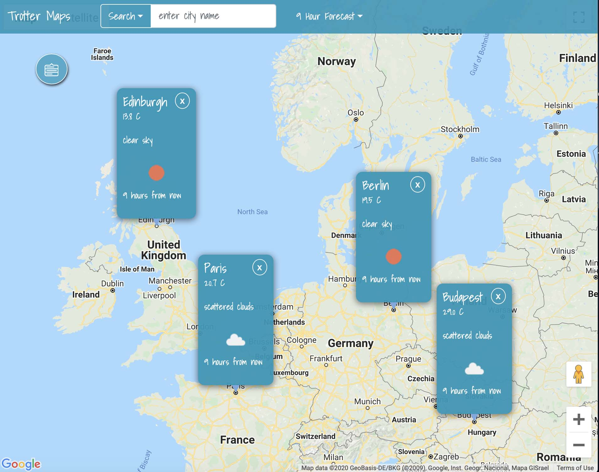
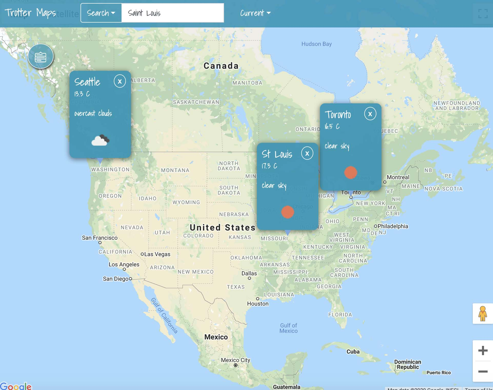

## TrotterMap

TrotterMap is inspired by features of weather reporting on broadcast TV that most internet based weather reporting sites lack. Combining the best from TV and the web, weather info from user's selected cities are displayed on Google Maps, using cards. A user can easily compare weather from different cities. Great for travellers and backpackers.

## Contributor

[Leonard Shen](https://github.com/UVStudio)

## Gallery

## TechStack:

- Google Maps API
- OpenWeatherMap API
- Express/Node.js
- jQuery

## Features

- A weather report and forecast app that displays weather info on Google Maps cards
- Users can choose which cities they want weather info from
- Weather info from selected cities are shown simultaneously
